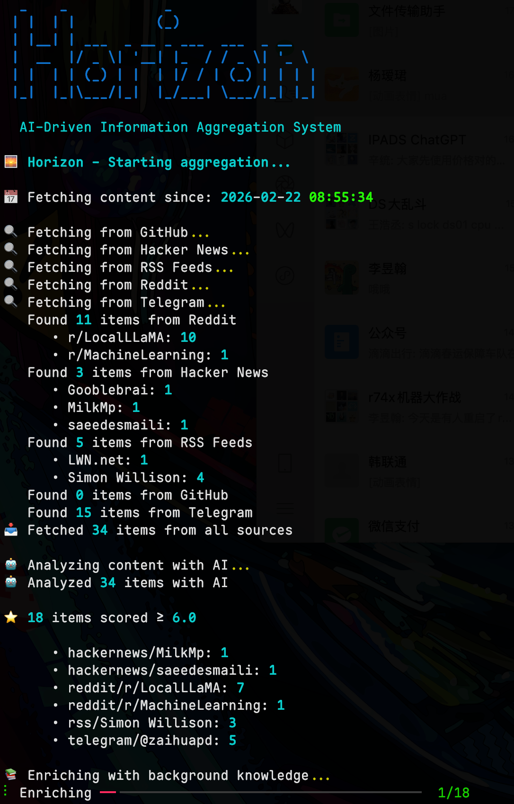
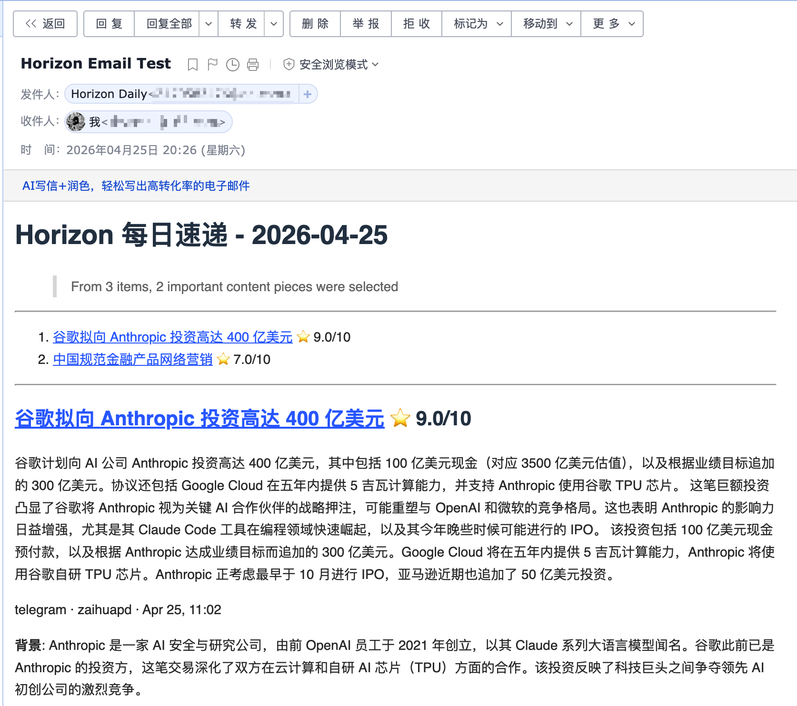
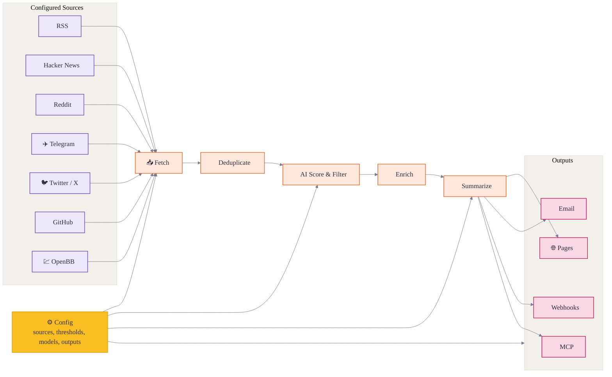

<div align="center">

# 🌅 Horizon

**ニュースそのものを楽しもう。あとはHorizonにおまかせを**

[](LICENSE)
[](https://github.com/astral-sh/uv)
[](https://thysrael.github.io/Horizon/)
[](https://github.com/Thysrael/Horizon/commits/main)
[](http://makeapullrequest.com)

<a href="https://hellogithub.com/repository/Thysrael/Horizon" target="_blank"></a>
<br>


📡 あなた専用のAI搭載ニュースレーダー。英語と中国語で日次ブリーフィングを生成します。 | 构建你专属的 AI 新闻雷达

[📖 ライブデモ](https://thysrael.github.io/Horizon/) · [📋 設定ガイド](https://thysrael.github.io/Horizon/configuration) · [English](README.md) · [简体中文](README_zh.md)

</div>

## スクリーンショット

<table>
<tr>
<td width="50%">
<p align="center"><strong>ランク付けされた日次ブリーフィング</strong></p>

</td>
<td width="50%">
<p align="center"><strong>背景・要約・ディスカッション</strong></p>

</td>
</tr>
</table>

<details>
<summary><strong>その他のスクリーンショット</strong></summary>
<br>
<table>
<tr>
<td width="33.33%">
<p align="center"><strong>ターミナル出力</strong></p>

</td>
<td width="33.33%">
<p align="center"><strong>Feishu通知</strong></p>

</td>
<td width="33.33%">
<p align="center"><strong>メール配信</strong></p>

</td>
</tr>
</table>
</details>

## なぜHorizonなのか？

良いニュースは散らばっていて、悪いニュースは尽きることがありません。Horizonは、Hacker News、Reddit、Telegram、RSS、GitHubに対する個人的な一次フィルタを提供します。記事を取得・重複排除・スコアリング・フィルタリングし、背景情報やコミュニティでの議論を付加します。

しかしHorizonは単なる要約ツールではありません。AIはノイズを減らすのが得意ですが、ニュースには依然として人間の感性が必要です。信頼できる情報源、記事の読み方を変えるコメント、そして人だけが共有できる隠れた逸品です。Horizonは、カスタマイズ可能な情報源・しきい値・モデル・言語・配信チャネル・コメント要約・コミュニティ情報源ハブによって、その人間のレイヤーをループに組み込み続けます。

## 機能

- **📡 自分だけの情報源を監視** — Hacker News、RSS、Reddit、Telegram、Twitter/X、GitHubのリリースやユーザーアクティビティ、OpenBBの金融ニュースウォッチリストを1つのパイプラインで追跡
- **🤖 ノイズを読むべきリストに変換** — Claude、GPT、Gemini、DeepSeek、Doubao、MiniMax、Ollama、またはOpenAI互換のあらゆるAPIで各記事を0〜10点でスコアリング
- **🔗 重複した記事を統合** — ブリーフィングに届く前に、プラットフォームをまたいで同じ記事を重複排除
- **🔍 背景を理解する** — 馴染みのない概念・企業・プロジェクト・専門用語について、Webで調べた背景情報を付加
- **💬 会話を読む** — Hacker News、Reddit、その他のサポート対象情報源からコミュニティのコメントを収集・要約
- **🌐 2言語で公開** — 同じ情報源セットから英語と中国語の日次ブリーフィングを生成
- **📝 日次サイトを公開** — 生成されたMarkdownをGitHub Pagesの日次ブリーフィングサイトとして公開
- **📧 メールで配信** — 購読・購読解除を自動処理するセルフホストのSMTP/IMAPニュースレターを運用
- **🔔 チャットや自動化へプッシュ** — テンプレート化された結果をFeishu/Lark、DingTalk、Slack、Discord、またはカスタムWebhookエンドポイントへ送信
- **🧙 興味から始める** — セットアップウィザードを使ってパーソナライズされた情報源設定を生成
- **⚙️ レーダーを調整** — 情報源・しきい値・モデル・言語・配信チャネルを1つのJSON設定からカスタマイズ

## 仕組み



1. **定義（Define）** — 情報源・しきい値・モデル・言語・配信を1つのJSON設定で構成します。
2. **取得（Fetch）** — 設定されたすべての情報源から最新コンテンツを並行して取得します。
3. **重複排除（Deduplicate）** — プラットフォームをまたいで、同じ記事やURLを指す項目を統合します。
4. **スコアリングとフィルタリング（Score & Filter）** — AIで項目をランク付けし、しきい値を超えるものだけを残します。
5. **エンリッチ（Enrich）** — 重要な項目について、Webで背景情報を検索しコミュニティの議論を収集します。
6. **要約（Summarize）** — 要約・タグ・参照を含む構造化されたMarkdownブリーフィングを生成します。
7. **配信（Deliver）** — 結果をGitHub Pages、メール、Feishuなどのwebhook、MCP、またはローカルファイルへ公開します。

## クイックスタート

### 1. インストール

**オプションA: ローカルインストール**

```bash
git clone https://github.com/Thysrael/Horizon.git
cd Horizon

# uvでインストール（推奨）
uv sync

# 必要に応じてテスト/開発用の追加依存をインストール
uv sync --extra dev

# またはpipで
pip install -e .
```

`dev`は現在`pyproject.toml`でオプションのextraとして定義されているため、pytestやその他の開発用依存には`uv sync --extra dev`を使用してください。

オプションのOpenBB金融ニュース情報源が必要な場合は、そのextraもインストールしてください。

```bash
uv sync --extra openbb
```

`openbb`がお使いの環境でwheelのないパッケージを取得する場合は、バイナリのみでSDKを手動インストールしてください。

```bash
uv pip install --only-binary=:all: openbb openbb-benzinga
```

**オプションB: Docker**

```bash
git clone https://github.com/Thysrael/Horizon.git
cd Horizon

# 環境を設定
cp .env.example .env
cp data/config.example.json data/config.json
# .env と data/config.json をAPIキーや好みに合わせて編集

# Docker Composeで実行
docker compose run --rm horizon

# またはカスタムの時間枠で実行
docker compose run --rm horizon --hours 48
```

### 2. 設定

**オプションA: 対話式ウィザード（推奨）**

```bash
uv run horizon-wizard
```

ウィザードはあなたの興味（例: 「LLM inference」「嵌入式」「web security」）について質問し、`data/config.json`を自動生成します。

**オプションB: 手動設定**

```bash
cp .env.example .env          # APIキーを追加
cp data/config.example.json data/config.json  # 情報源をカスタマイズ
```

最小限の手動設定:

```jsonc
{
  "ai": {
    "provider": "openai",
    "model": "gpt-4",
    "api_key_env": "OPENAI_API_KEY"
  },
  "sources": {
    "rss": [
      { "name": "Simon Willison", "url": "https://simonwillison.net/atom/everything/" }
    ]
  },
  "filtering": {
    "ai_score_threshold": 6.0
  }
}
```

**バランス調整されたダイジェスト（オプション）**

最終的なダイジェストのサイズを制限し、1つのカテゴリが結果を支配しないようにします。カテゴリは`sources.rss[].category`などの情報源設定から取得されます。

```jsonc
{
  "filtering": {
    "ai_score_threshold": 6.0,
    "max_items": 20,
    "category_groups": {
      "ai": {
        "limit": 5,
        "categories": ["ai-news", "ai-tools", "machine-learning"]
      },
      "finance": {
        "limit": 5,
        "categories": ["finance", "business", "equities"]
      }
    },
    "default_group": "other",
    "default_group_limit": 3
  }
}
```

グループの上限は、AIスコアによるフィルタリングの後、エンリッチの前に適用されます。`category_groups`と`max_items`を省略した場合、フィルタリングは従来どおりに動作します。

`api_key_env`はAPIキーそのものではなく、環境変数の名前でなければなりません。実際のシークレットは`.env`に記述してください。

```bash
OPENAI_API_KEY=sk-your-key
```

Geminiの場合は`GOOGLE_API_KEY`を使用します。

```jsonc
{
  "ai": {
    "provider": "gemini",
    "model": "gemini-2.0-flash",
    "api_key_env": "GOOGLE_API_KEY"
  }
}
```

`data/config.json`内の任意の文字列値は、`${VAR_NAME}`で環境変数を参照できます。これは`ai.base_url`、非公開のRSSフィードURL、webhookエンドポイント、カスタムヘッダーテンプレートなどの値に便利です。

完全なリファレンスについては、[設定ガイド](docs/configuration.md)を参照してください。

### 3. 実行

#### ローカルインストール

```bash
uv run horizon           # デフォルトの24時間枠で実行
uv run horizon --hours 48  # 過去48時間から取得
```

#### Dockerで

```bash
docker compose run --rm horizon           # デフォルトの24時間枠で実行
docker compose run --rm horizon --hours 48  # 過去48時間から取得
```

生成されたレポートは`data/summaries/`に保存されます。

### 4. 自動化（オプション）

Horizonは**GitHub Actions**のcronジョブとして最適に動作します。日次ブリーフィングを生成しGitHub Pagesへ自動デプロイする、すぐに使えるワークフローについては[`.github/workflows/daily-summary.yml`](.github/workflows/daily-summary.yml)を参照してください。

## サポートされている情報源

| 情報源 | 取得する内容 | コメント |
|--------|----------------|----------|
| **Hacker News** | スコア順のトップ記事 | あり（上位N件のコメント） |
| **RSS / Atom** | 任意のRSSまたはAtomフィード | — |
| **Reddit** | サブレディット + ユーザー投稿 | あり（上位N件のコメント） |
| **Telegram** | 公開チャンネルのメッセージ | — |
| **Twitter / X** | 特定ユーザーのツイート | あり（上位N件の返信） |
| **GitHub** | ユーザーイベント & リポジトリのリリース | — |
| **OpenBB** | ウォッチリスト/プロバイダー別の企業金融ニュース | — |

## ブリーフィングの届け先

Horizonは、生成されたブリーフィングをいくつかの方法で公開・配信できます。

| チャネル | 内容 |
|---------|--------------|
| **GitHub Pages 日次サイト** | 生成されたMarkdownを`docs/`にコピーし、GitHub Pagesが毎日更新されるブリーフィングサイトを公開できるようにします |
| **メール購読** | 日次ブリーフィングを購読者に送信し、SMTP/IMAPを通じて購読・購読解除リクエストを処理します |
| **Webhook通知** | 成功または失敗の結果をFeishu/Lark、DingTalk、Slack、Discord、または任意のカスタムWebhookエンドポイントへプッシュします |
| **MCPサーバー** | Horizonのパイプラインステップをツールとして公開し、AIアシスタントが取得・スコアリング・フィルタリング・エンリッチ・要約・ワークフロー全体の実行を行えるようにします |

セットアップの詳細については、[設定ガイド](docs/configuration.md)を参照してください。MCPツールのリファレンスとクライアントのセットアップについては、[`src/mcp/README.md`](src/mcp/README.md)と[`src/mcp/integration.md`](src/mcp/integration.md)を参照してください。

## サポーター

Horizonは余暇に運営されているオープンソースプロジェクトです。プロジェクトを支援したい、またはここに掲載されたい場合は、お気軽に[issueを開く](https://github.com/Thysrael/Horizon/issues/new)か[メールでご連絡ください](mailto:thysrael@163.com)。

| サポーター | 詳細 |
|-----------|---------|
| [](https://www.compshare.cn/?ytag=GPU_YY_git_Horizon) | Compshareは現在Horizonをサポートしています。CompshareはUCloudのAIクラウドプラットフォームで、月額49人民元から始まるコスト効率の良い月額・従量課金の国内モデルエージェントプランや、安定した公式リレーの海外モデルを提供しています。Claude Code、Codex、APIの利用に対応し、エンタープライズグレードの高同時実行、24時間365日の技術サポート、セルフサービスの請求書発行を備えています。<br><br>彼らの[リンク](https://www.compshare.cn/?ytag=GPU_YY_git_Horizon)から登録すると、無料で5人民元のトライアルクレジットを受け取れます。 |

## ドキュメント

| ガイド | 説明 |
|-------|-------------|
| [設定](docs/configuration.md) | AIプロバイダー、情報源、フィルタリング、メール、webhook、GitHub Pages、MCPのセットアップ |
| [スコアリング](docs/scoring.md) | Horizonがニュース項目を評価・ランク付けする方法 |
| [スクレイパー](docs/scrapers.md) | 情報源スクレイパーの詳細と拡張に関する注記 |
| [MCPツール](src/mcp/README.md) | MCP互換クライアント向けのツールリファレンス |

## プロジェクトの状況

Horizonはすでに日次ブリーフィングの全ループをサポートしています。マルチソース収集、AIスコアリング、重複排除、エンリッチ、コメント要約、2言語生成、GitHub Pages公開、メール配信、webhook配信、Dockerデプロイ、MCP統合、セットアップウィザードです。

予定している改善:

- Discordなど、より多くの情報源タイプ
- 情報源ごとのカスタムスコアリングプロンプト
- GitHubでのリリース公開
- `pip install`用にPyPIへパッケージを公開

## コントリビューション

コントリビューションを歓迎します。コード、ドキュメント、情報源共有のガイドラインについては[CONTRIBUTING.md](CONTRIBUTING.md)を参照してください。

### 情報源を共有する

価値のある情報源の発見をHorizonコミュニティと共有したいですか？ ぜひ**[horizon1123.top](https://horizon1123.top)**から投稿してください。

## 謝辞

- プロモーションの場を提供してくださった[LINUX.DO](https://linux.do/)に特別な感謝を。
- 貴重な指導と提案をいただいた[HelloGitHub](https://hellogithub.com/)に特別な感謝を。
- 小紅書（XiaoHongShu）でのプロモーションをしてくださった[AIGC Link](https://xhslink.com/m/80ngts127cA)に特別な感謝を。

## ライセンス

[MIT](LICENSE)
